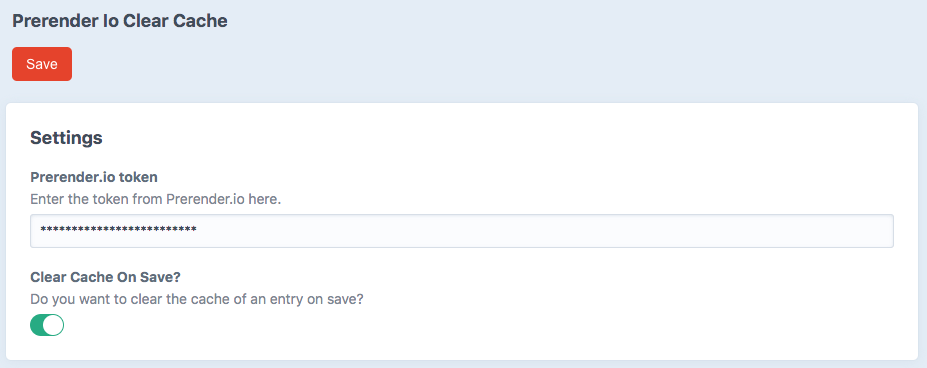

# Prerender Io Clear Cache plugin for Craft CMS >=3.5

Clear the cache on entries save from prerender.io


## Requirements

This plugin requires Craft CMS 3.5.0 or later.

## Installation

To install Prerender Io Clear Cache, follow these steps:

1. Install with Composer via composer require kffein/prerender-io-clear-cache from your project directory
2. Install plugin in the Craft Control Panel under Settings > Plugins

You can also install Prerender Io Clear Cache via the Plugin Store in the Craft AdminCP.


## Overview

This plugin allows you to: 

- Clear the cache when saving an entry.
- Clear all caches via utilities.
- Clear all caches via CLI command.

## Configuration


You must enter the token provided by prerender to access the API.

The Clear cache on save option allows you to delete the cache when saving the entry.


## Using craft-export-csv

When the entry is saved, the EVENT_AFTER_SAVE_ELEMENT event retrieves the url of the entry and calls the Prerender API in order to delete this Url. Depending on the section save strategy, entries from other sites will also be deleted.

It is possible to delete all caches of all entries via utilities


It is also possible to delete all caches of all entries via the CLI
```
./craft prerender-io-clear-cache/default/clearallcache
```
## Prerender Io Clear Cache Roadmap

- [ ] Manage categories urls
- [ ] Manage commerce products urls
- [ ] Delete specific url
- [ ] Validate if page exists

## Credits

Brought to you by [Kffein](https://kffein.com)
